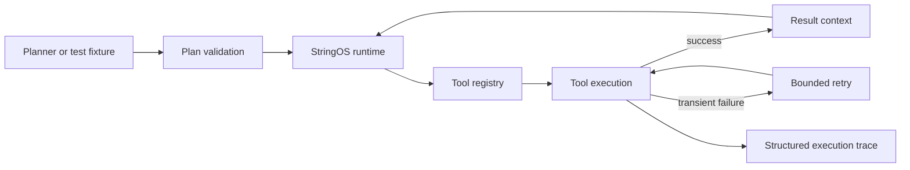

# StringOS

StringOS is an **experimental runtime for reliable, auditable tool-using agents**. The current research prototype focuses on the execution layer: validating planner output, running tools, recovering from transient failures with bounded retries, and producing structured traces that make agent behaviour inspectable.

This repository started as a broader autonomous-agent/"agent OS" experiment. The scope is intentionally narrower now: make one execution path measurable and reproducible before adding more autonomy.

## What works today

- A single documented plan schema (`tool`, `args`, optional `id` and `max_retries`)
- Explicit tool registration and unknown-tool rejection before execution
- Passing earlier tool results to later calls using `{"$ref": "step_id"}`
- Bounded retries for transient tool failures
- JSON execution traces containing attempts, latency, status, errors, and result previews
- A zero-dependency reliability demo with deterministic failure injection
- Unit tests for execution, references, validation, retries, failure exhaustion, and trace persistence

## What is experimental

- `agentgpt/` contains an early custom TinyGPT planner experiment trained on a very small command corpus. It is **not** the default production planner and should not be interpreted as a general-purpose language model.
- The older `agentos/` modules contain exploratory code from earlier iterations. The supported entry point is the `stringos/` package and `main.py` described below.
- Autonomous recursive planning, permission policies, and model-driven recovery are research directions, not completed features.

## Runtime architecture



The planner is deliberately outside the runtime boundary. A local model, hosted model, human, or benchmark fixture can emit the same schema. This lets planner quality and execution reliability be evaluated separately.

## Quick start

Requires Python 3.10+ and no third-party packages for the default runtime.

```bash
git clone https://github.com/advikjaiswal/StringOS.git
cd StringOS
python main.py
```

The demo reads a text file, summarizes it, injects one transient write failure, retries the tool, writes the result, and saves a machine-readable trace:

```text
StringOS reliability demo
-------------------------
OK    read     tool=read_text      attempt=1 ...
OK    summary  tool=summarize_text attempt=1 ...
RETRY write    tool=write_text     attempt=1 ... (OSError: injected transient failure)
OK    write    tool=write_text     attempt=2 ...

completed=True
output=.stringos_demo/summary.txt
trace=.stringos_demo/trace.json
```

Run the tests:

```bash
python -m unittest discover -s tests -v
```

## Plan schema

```json
[
  {
    "id": "read",
    "tool": "read_text",
    "args": {"path": "notes.txt"}
  },
  {
    "id": "summary",
    "tool": "summarize_text",
    "args": {"text": {"$ref": "read"}}
  },
  {
    "id": "write",
    "tool": "write_text",
    "args": {"path": "summary.txt", "content": {"$ref": "summary"}},
    "max_retries": 1
  }
]
```

`max_retries` is capped at three. The runtime rejects unknown tools and malformed plans before beginning execution.

## Current research questions

The next useful experiments are deliberately measurable:

1. How often do different planners produce schema-valid plans and correct tool selections?
2. How much do bounded retry and validation policies improve task completion under injected tool failures?
3. Which execution-trace features are most useful for diagnosing long-horizon agent failures?
4. How should approval checkpoints be represented without coupling policy decisions to individual tools?

Planned evaluation metrics include plan-validity rate, tool-selection accuracy, end-to-end task success, recovery success under injected failures, and hallucinated-tool-call rate.

## TinyGPT experiment

The legacy `agentgpt/` directory contains a small Transformer experiment trained from scratch with SentencePiece and PyTorch. Its dataset is intentionally small and is best treated as an educational planner experiment. Optional dependencies are listed in `requirements-experimental.txt`.

The default StringOS runtime does **not** depend on TinyGPT. Future work will add a proper held-out evaluation before making claims about planner generalization.

## Project status

Research prototype. The goal is reproducible evidence about agent execution reliability—not a claim that StringOS is a complete autonomous operating system.
